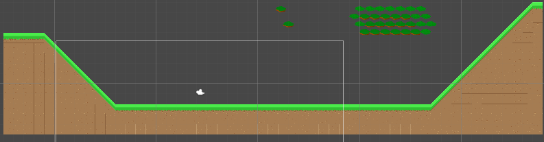
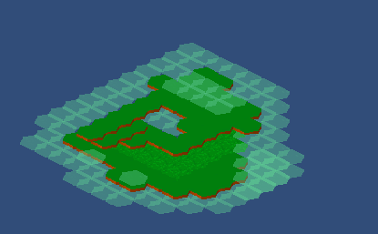
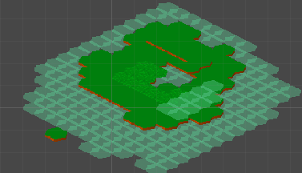

# Tilesets

En esta práctica se mostrarán los tipos de tileset utilizados. El primero de todos es el normal, el que también he utilizado en los proyectos de las demás prácticas.
La imagen de abajo es un ejemplo creado para esta práctica

La siguiente incluye un mapa isométrico con zonas elevadas, como se puede apreciar, es una isla rodeada por agua, pero luego, para apreciar mejor los diferentes niveles, se puede ver como hay agua encima del césped, al igual que hay otro nivel superior de tierra

